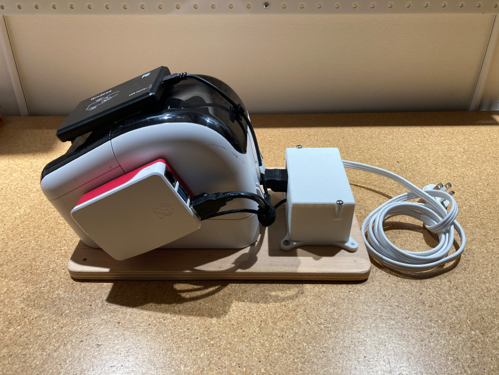
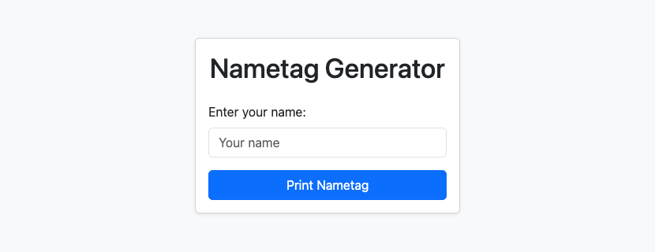

# PS:1 Nametag Printer




## Features

1. Members can scan their RFID fobs to get nametags
    1. Uses the "Preferred Name" field, if one is specified
    2. Else, uses the "First Name" field only (for privacy)
2. Custom nametag support via an integrated webserver




## Hardware

1. [Brother QL800](https://www.brother-usa.com/products/ql800)
2. [Raspberry Pi 4 Model B (1 GB)](https://wiki.geekworm.com/Raspberry_Pi_4_Model_B)
3. [125Khz EM4100 USB RFID ID Card Reader](https://www.amazon.com/dp/B01MZYYDUV)


## Prerequisites

Setup your Raspberry Pi:

1. Install [Raspberry Pi OS Lite (64-bit)](https://www.raspberrypi.com/software/operating-systems/) 
2. Wi-Fi connection is live
3. SSH access enabled
4. RPi is running


## Wild Apricot Credentials

The nametag printer needs to query our membership database to retrieve names based on scanned RFID tags. It authenticates to the API as an [external application](https://gethelp.wildapricot.com/en/articles/180/). If you set up a new microSD card for the printer, you need to copy the app credentials into its environment. This only needs to be done once.

1. You must be an admin for the PS:1 Wild Apricot account
2. Navigate to the [Authorized applications](https://membership.pumpingstationone.org/admin/apps/integration/authorized-applications/) page in the dashboard
3. Open the `nametag-printer` application
4. Copy the "API key", "Client ID", and "Client secret"

If the application was deleted, create a new one. Restrict it to "Read only".

Create a `.env` file in the root of this repo, wherever you cloned it.

> [!CAUTION]
> Do not commit the `.env` file! It is in `.gitignore`, so this should be hard to do.

Paste the credentials you copied into the `.env` file:

```shell
WA_CLIENT_ID=""
WA_CLIENT_SECRET=""
WA_API_KEY=""
```

When you run Ansible, it'll check if this `.env` file exists and is filled out. If so, Ansible will sync the `.env` to the RPi, and restart application services.


## Ansible

[Install Ansible](https://docs.ansible.com/projects/ansible/latest/installation_guide/intro_installation.html) using whatever method. Then, install this application's [requirements](https://docs.ansible.com/projects/ansible/latest/galaxy/user_guide.html):

```bash
# Always run Ansible commands from the `ansible` subdir
$ cd ./ansible

# Install requirements
$ ansible-galaxy install -r requirements.yml

# Test your connection
$ ansible nametags -a "echo hi"
nametags | CHANGED | rc=0 >>
hi
```

Our Ansible inventory assumes the following:

* Hostname: `nametags`
* User: `pi`

If the RPi has a different hostname or user, update the inventory, or specify `-h` and/or `-u`:

```bash
ansible -i hostname -u user -a "echo hi"
```

Run the playbook:

```bash
ansible-playbook playbook.yml
```

This will setup the RPi from a fresh state. It's safe to run multiple times.

> [!TIP]
> You must run the playbook whenever you want to deploy code updates.


## Printer CLI

This application includes [brother_ql_next](https://github.com/LunarEclipse363/brother_ql_next) as a requirement. While SSH'd into the RPi, you can use the CLI provided by that package to check on the printer. There's no need to do this, but it's interesting for debugging.

```bash
# Change directory to where we deployed the app
cd /app

# Check on the printer status (sudo required)
sudo uv run brother_ql \
    --printer usb://0x04f9:0x209b \
    --model QL-800 \
    --backend pyusb \
    status
```


## Development

Use the [uv](https://docs.astral.sh/uv/getting-started/installation/#standalone-installer) project manager to work with this project. Sample commands:

```bash
# Create a virtual environment and install all dependencies
uv sync

# Start the webserver in development mode
uv run python -m nametags.webserver
```

If you modify `pyproject.toml`, run `uv sync` and commit `uv.lock` changes.

This repo contains some configs to support VSCode and common tooling:

- [.vscode/settings.default.json](.vscode/settings.default.json) = [Workspace Default Settings](https://marketplace.visualstudio.com/items?itemName=dangmai.workspace-default-settings) for VSCode
- [.editorconfig](.editorconfig) = [EditorConfig](https://editorconfig.org/) ([extension](https://marketplace.visualstudio.com/items?itemName=EditorConfig.EditorConfig))
- [.flake8](.flake8) = [flake8](https://flake8.pycqa.org/en/latest/) ([extension](https://marketplace.visualstudio.com/items?itemName=ms-python.flake8))


## Acknowledgements

- https://github.com/LunarEclipse363/brother_ql_next
- [WaApi.py](src/nametags/WaApi.py) was provided by [Wild Apricot](https://github.com/WildApricot/ApiSamples/blob/master/python/WaApi.py)
